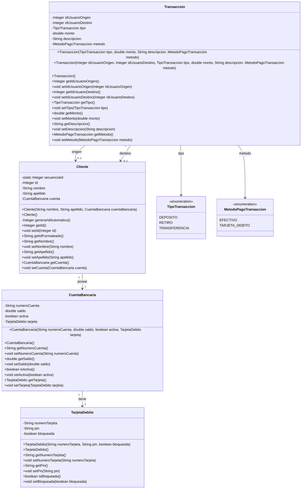

# Sistema Bancario Encapsulado

Este proyecto implementa una gestion bancaria simple en consola usando Java. Modela clientes, cuentas bancarias, tarjetas de debito y transacciones, con una estructura orientada a encapsulamiento y validacion de datos.

El sistema permite:

- crear clientes con su cuenta y tarjeta asociada
- iniciar sesion con el PIN de la tarjeta
- realizar depositos, retiros y transferencias
- listar clientes, cuentas, tarjetas y transacciones

La informacion se maneja en memoria mediante listas globales, por lo que el proyecto esta pensado como una demostracion de logica de negocio, validaciones y relacion entre clases, no como una aplicacion persistente con base de datos.

## Dependencias

Para correr este proyecto necesitas lo siguiente:

- Git instalado
- IntelliJ IDEA
- JDK 21

## Cómo clonar el repositorio

1. Abre la carpeta donde quieres clonar el proyecto.
2. Haz clic derecho dentro de esa carpeta y abre la terminal o bash desde ese contexto.
3. Ejecuta: `git clone https://github.com/rarcorp481/SistemaBancarioEncapsulamiento.git`.
4. Abre IntelliJ IDEA.
5. Selecciona la opcion para abrir un proyecto existente.
6. Elige la carpeta clonada y deja que IntelliJ indexe el proyecto.

## Relacion entre clases

La clase `Cliente` representa al titular de la cuenta. Cada cliente tiene un `id` autogenerado, nombre, apellido y una instancia de `CuentaBancaria`.

`CuentaBancaria` guarda el numero de cuenta, el saldo, el estado de activacion y la `TarjetaDebito` asociada. Es la clase donde realmente vive el saldo que se modifica cuando ocurren operaciones bancarias.

`TarjetaDebito` contiene el numero de tarjeta, el PIN y si la tarjeta esta bloqueada o no. Se usa para iniciar sesion y para validar acceso al sistema.

`Transaccion` representa una operacion bancaria. Guarda el tipo de transaccion, el monto, la descripcion, el metodo de pago y los ids del usuario origen y destino cuando aplica.

`TipoTransaccion` define si la operacion es un `DEPOSITO`, `RETIRO` o `TRANSFERENCIA`.

`MetodoPagoTransaccion` define el medio usado en la operacion: `EFECTIVO` o `TARJETA_DEBITO`.

## Como interactuan

La interaccion principal sigue este flujo:

1. El usuario se registra como `Cliente`.
2. El cliente obtiene una `CuentaBancaria` y una `TarjetaDebito`.
3. Para iniciar sesion, el sistema busca el cliente y valida el PIN de su tarjeta.
4. Cuando se realiza una transaccion, el sistema crea un objeto `Transaccion`.
5. Segun el tipo, el servicio correspondiente busca al cliente origen o destino, accede a su cuenta y modifica el saldo.
6. La transaccion queda registrada en memoria dentro de la lista global.

En resumen, `Cliente` agrupa la identidad del usuario, `CuentaBancaria` concentra el saldo, `TarjetaDebito` controla el acceso y `Transaccion` representa el movimiento de dinero. Los servicios y validadores coordinan las reglas y operaciones sobre esos modelos.

## Diagrama de clases

